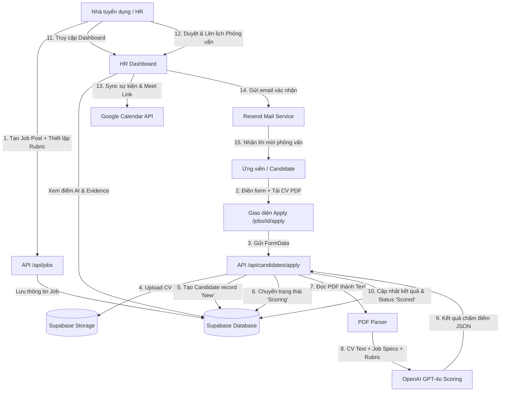

# TÌNH TRẠNG DỰ ÁN: HỆ THỐNG TUYỂN DỤNG THÔNG MINH (AI-POWERED RECRUITMENT SYSTEM)

Tài liệu này tóm tắt toàn bộ flow hoạt động cốt lõi của hệ thống và cập nhật trạng thái chi tiết các công việc đã hoàn thành, đang làm và chưa làm (Implementation Status) của dự án.

---

## 1. Flow Hoạt Động Tổng Quan (System Workflow)

Hệ thống hoạt động dựa trên sự phối hợp giữa ứng viên (Candidate), hệ thống xử lý tự động (API & PDF Parser), bộ não trí tuệ nhân tạo (OpenAI GPT-4o) dựa trên Rubric chuẩn hóa, và giao diện quản trị dành cho nhà tuyển dụng (HR/Recruiter).

Dưới đây là sơ đồ luồng hoạt động từ lúc bắt đầu đăng tin tuyển dụng cho đến khi chấm điểm ứng viên và lên lịch phỏng vấn:

### Các bước hoạt động chi tiết:

1. **Thiết lập Vị trí Tuyển dụng (Job Posting Setup):**
   - Nhà tuyển dụng (HR) tạo một tin tuyển dụng mới kèm các yêu cầu về kỹ năng (`required_skills`), kinh nghiệm (`experience_requirement`), và cấu hình trọng số Rubric chấm điểm (mặc định: `Job Fit 50%`, `Potential 30%`, `Cultural Fit 20%`).
2. **Ứng viên Nộp Hồ sơ (Candidate Submission):**
   - Ứng viên truy cập vào liên kết ứng tuyển của công việc (`/jobs/[id]/apply`), điền thông tin cá nhân (Họ tên, Email, SĐT, Giới thiệu bản thân) và đăng tải tệp tin CV định dạng **PDF**.
3. **Tiếp Nhận và Lưu Trữ (Ingestion & Storage):**
   - API `/api/candidates/apply` nhận dữ liệu, tải trực tiếp tệp CV lên phân vùng lưu trữ bảo mật **Supabase Storage** (bucket `cv_uploads`) để lưu lại bản gốc và tạo URL truy cập.
   - Một bản ghi ứng viên được tạo mới trong bảng `candidates` với trạng thái ban đầu là `New`.
4. **Phân Tích & Chấm Điểm AI (AI Parsing & Scoring Pipeline):**
   - Trạng thái ứng viên được cập nhật sang `Scoring`.
   - Hệ thống tiến hành trích xuất nội dung văn bản thô từ tệp PDF bằng thư viện `pdf-parse`.
   - Hệ thống truy vấn thông tin JD và Rubric từ bảng `jobs` để làm ngữ cảnh.
   - Toàn bộ thông tin được đóng gói và gửi tới mô hình ngôn ngữ lớn **OpenAI GPT-4o** bằng cơ chế **Structured Outputs** (thông qua schema xác thực bằng thư viện **Zod**). Hệ thống có cài đặt cơ chế tự động thử lại (Retry Exponential Backoff) khi có lỗi mạng hoặc lỗi API.
   - AI thực hiện đánh giá toàn diện theo 12 Quy tắc Rubric nghiêm ngặt (ưu tiên Job Fit, phạt nặng Job hopping, phát hiện rủi ro trái ngành, ghi nhận năng lực qua portfolio, trích xuất dẫn chứng cụ thể từ CV mà không bịa đặt thông tin).
5. **Cập Nhật Kết Quả (Persisting Assessment):**
   - Điểm số chi tiết (`Job Fit`, `Potential`, `Cultural Fit`, `Total Score`), đề xuất tuyển dụng (`STRONG HIRE`, `HIRE`, `CONSIDER`, `REJECT`), lý do đánh giá, rủi ro, thế mạnh, các thông tin còn thiếu, câu hỏi phỏng vấn gợi ý và các minh chứng (evidence) được cập nhật lại vào bảng `candidates` với trạng thái `Scored`.
6. **Xem Xét & Lên Lịch (Review & Interviewing):**
   - HR đăng nhập vào hệ thống, xem bảng xếp hạng ứng viên đã được chấm điểm tự động. Xem chi tiết từng hồ sơ kèm các lý giải và cảnh báo rủi ro từ AI.
   - Đối với ứng viên đạt yêu cầu, HR lên lịch phỏng vấn. Hệ thống tự động tạo sự kiện trên **Google Calendar**, đính kèm link **Google Meet**, đồng thời gửi email thông báo tự động cho ứng viên thông qua dịch vụ **Resend**.

---

## 2. Chi Tiết Trạng Tái Triển Khai (Implementation Status)

### 2.1. Đã hoàn thành (Completed)

Các cấu phần nền tảng, thiết kế cơ sở dữ liệu, lõi chấm điểm AI và luồng API nộp hồ sơ đã được thiết lập vững chắc:

#### A. Kiến trúc Cơ sở Dữ liệu & Storage (Supabase)
- [x] **Database Schema**: Tạo file [schema.sql](file:///c:/Automation%20Filter%20Candidates/supabase/schema.sql) hoàn chỉnh với 4 bảng chính (`users`, `jobs`, `candidates`, `interviews`) cùng các chính sách bảo mật RLS và thiết lập cấu hình bucket `cv_uploads`.
- [x] **Supabase Client**: Tạo file [supabase.ts](file:///c:/Automation%20Filter%20Candidates/src/lib/supabase.ts) kết nối Supabase thông qua biến môi trường phục vụ lưu trữ file và truy vấn dữ liệu.

#### B. Thiết kế Rubric & Quy tắc Chấm Điểm AI (AI Screening Logic)
- [x] **Rubric Specification**: Thiết kế tài liệu [rubric-design.md](file:///c:/Automation%20Filter%20Candidates/docs/rubric-design.md) chi tiết định nghĩa thang điểm và công thức tính điểm:
  `total_score = (Job Fit * 0.5) + (Potential * 0.3) + (Cultural Fit * 0.2)`
- [x] **AI Schema Validation**: Viết schema định dạng đầu ra [schema.ts](file:///c:/Automation%20Filter%20Candidates/src/services/ai/schema.ts) bằng thư viện **Zod** để đảm bảo AI luôn trả về dữ liệu cấu trúc JSON chặt chẽ, ngăn ngừa lỗi cú pháp.
- [x] **System Prompts**: Soạn thảo tập luật [prompts.ts](file:///c:/Automation%20Filter%20Candidates/src/services/ai/prompts.ts) chuyển hóa 12 quy tắc nghiệp vụ tuyển dụng thành chỉ thị cho AI (Job Fit, Job Hopping, Trái ngành, Năng lực portfolio, Trích xuất bằng chứng).
- [x] **OpenAI Integration & Robust Retry Logic**: Xây dựng service [scoring.ts](file:///c:/Automation%20Filter%20Candidates/src/services/ai/scoring.ts) tích hợp OpenAI GPT-4o kèm thuật toán tự động thử lại tăng tiến (Exponential Backoff) nếu gặp lỗi từ server AI.

#### C. Xử Lý File PDF (PDF Parsing)
- [x] **PDF Text Extraction**: Phát triển tiện ích [pdf-parser.ts](file:///c:/Automation%20Filter%20Candidates/src/lib/pdf-parser.ts) sử dụng thư viện `pdf-parse` giúp trích xuất văn bản thô từ file PDF buffer tải lên, tự động dọn dẹp khoảng trắng dư thừa giúp tối ưu hóa tokens gửi tới OpenAI.

#### D. Luồng API & Giao Diện Phía Ứng Viên (Candidate Facing Flow)
- [x] **Public API Job Route**: Hoàn thiện API [route.ts](file:///c:/Automation%20Filter%20Candidates/src/app/api/jobs/route.ts) hỗ trợ lấy danh sách vị trí tuyển dụng đang tuyển (`GET`) và tạo tin tuyển dụng mới kèm rubric (`POST`).
- [x] **Apply API Pipeline**: Hoàn thành luồng khép kín tại [route.ts](file:///c:/Automation%20Filter%20Candidates/src/app/api/candidates/apply/route.ts) xử lý: nhận FormData -> upload PDF lên Supabase Storage -> tạo record ứng viên -> parse PDF thành chữ -> gọi OpenAI chấm điểm theo rubric -> cập nhật kết quả đánh giá vào database.
- [x] **Candidate Apply Page**: Thiết kế giao diện nộp đơn chuyên nghiệp tại [page.tsx](file:///c:/Automation%20Filter%20Candidates/src/app/jobs/[id]/apply/page.tsx) hỗ trợ Drag & Drop file CV, hiển thị trạng thái đang xử lý và màn hình thành công khi hoàn tất.

#### E. Hệ Thống Kiểm Thử (Unit Tests Mockup)
- [x] **Test Cases**: Tạo file [scoring.test.ts](file:///c:/Automation%20Filter%20Candidates/src/services/ai/__tests__/scoring.test.ts) thiết lập sẵn 5 kịch bản kiểm thử giả định quan trọng: ứng viên hoàn hảo (Strong Hire), ứng viên trái ngành (Reject), ứng viên thiếu kinh nghiệm nhưng có portfolio mạnh (Consider), ứng viên nhảy việc nhiều (Job Hopper) và ứng viên thiếu thông tin (Low Confidence).

---

### 2.2. Đang thực hiện (In Progress)

- [ ] **Tích hợp Supabase Auth & Phân Quyền Người Dùng (Role-based Authentication)**:
  - Đang thiết lập cấu hình Supabase Auth hỗ trợ đăng nhập dành riêng cho HR/Admin.
  - Phục vụ việc phân quyền xem CV ứng viên và tạo JD (Hiện tại các chính sách RLS trong database đang mở cho phép `public` truy cập thuận tiện cho phát triển ban đầu, cần được thắt chặt bảo mật hơn).

---

### 2.3. Chưa thực hiện (To-Do / Backlog)

#### A. Giao diện Nhà Tuyển Dụng (HR Dashboard Frontend)
- [ ] **Trang chủ Dashboard (`/`)**: 
  - Thay thế trang boilerplate mặc định của Next.js bằng một giao diện Dashboard cao cấp với chế độ Dark mode/Glassmorphism sang trọng.
  - Hiển thị thống kê tổng quan (Số vị trí đang tuyển, số lượng ứng viên nộp, tỉ lệ đề xuất tuyển dụng STRONG HIRE/HIRE).
  - Danh sách các Jobs hiện tại kèm trạng thái.
- [ ] **Trang Quản lý Vị trí Tuyển dụng (`/jobs`)**:
  - Giao diện thêm mới công việc kèm form tùy chỉnh trọng số Rubric và các tiêu chí yêu cầu (skills, years of experience).
- [ ] **Trang Danh sách & Chi tiết Ứng viên (`/candidates` & `/candidates/[id]`)**:
  - Bảng danh sách ứng viên có chức năng lọc theo điểm số, theo quyết định đề xuất (`STRONG HIRE`, `HIRE`, `CONSIDER`, `REJECT`), tìm kiếm theo tên/kỹ năng.
  - Trang chi tiết ứng viên hiển thị so sánh trực quan giữa CV ứng viên và JD. Biểu đồ Radar/Bar thể hiện 3 đầu điểm (Job Fit, Potential, Cultural Fit).
  - Hiển thị danh sách điểm mạnh, điểm yếu, các rủi ro được AI gắn cờ (Flags) nổi bật.
  - Hiển thị các bằng chứng (Evidence) trích dẫn trực tiếp để HR đối chiếu nhanh mà không cần mở file PDF gốc.
  - Hiển thị bộ câu hỏi phỏng vấn được AI đề xuất riêng cho hồ sơ ứng viên này.

#### B. Tích Hợp Lịch Hẹn & Google Calendar API (Interview Scheduling)
- [ ] **Tích hợp OAuth Google Calendar**:
  - Thiết lập luồng lấy token ủy quyền (`google_calendar_token`) từ tài khoản Google của HR/Interviewer để đồng bộ lịch.
- [ ] **Tính năng Tạo Lịch Hẹn Tự Động**:
  - HR chọn thời gian phỏng vấn, chọn Interviewer hỗ trợ.
  - Hệ thống gọi Google Calendar API tạo sự kiện lịch, tự động đính kèm liên kết **Google Meet** và cập nhật `google_event_id` cùng `meet_link` vào bảng `interviews`.

#### C. Hệ thống Thông báo qua Email (Email Notifications)
- [ ] **Tích hợp Resend API**:
  - Viết email service sử dụng thư viện `resend` đã cài đặt trong dự án.
- [ ] **Hệ thống Email Templates**:
  - Email tự động gửi cho ứng viên khi nộp hồ sơ thành công.
  - Email gửi thư mời phỏng vấn chứa thông tin thời gian, danh sách người phỏng vấn và liên kết Google Meet.
  - Email gửi thông báo kết quả (Đồng ý/Từ chối).

---

## 4. Kế Hoạch Triển Khai Tiếp Theo (Next Steps)

1. **Phát triển UI Dashboard**: Bắt đầu bằng việc thay thế giao diện `/src/app/page.tsx` để hiển thị dashboard HR quản lý các vị trí đang tuyển dụng và danh sách ứng viên nộp hồ sơ.
2. **Xây dựng API Quản lý Ứng Viên**: Tạo thêm các API endpoint phục vụ việc lấy thông tin chi tiết ứng viên (`GET /api/candidates/[id]`) và cập nhật trạng thái hồ sơ ứng viên (`PATCH /api/candidates/[id]`).
3. **Triển khai Resend Email**: Viết service gửi thư thông báo để tự động kích hoạt email ngay khi trạng thái ứng viên thay đổi hoặc lịch phỏng vấn được tạo.
4. **Kết nối Google Calendar**: Cấu hình credentials trong Google Cloud Console và viết router xử lý callback OAuth đồng bộ lịch phỏng vấn.
